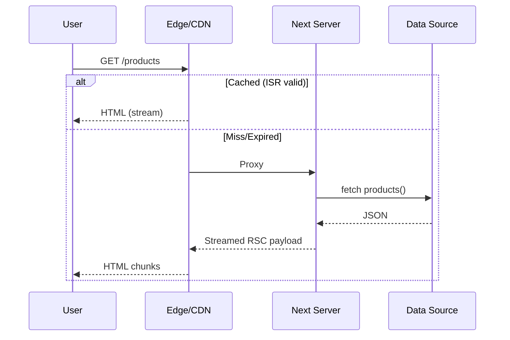
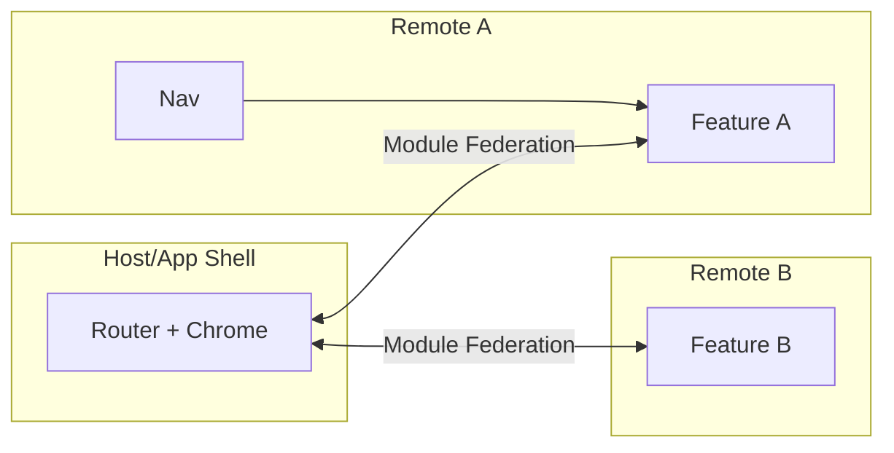
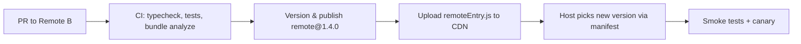
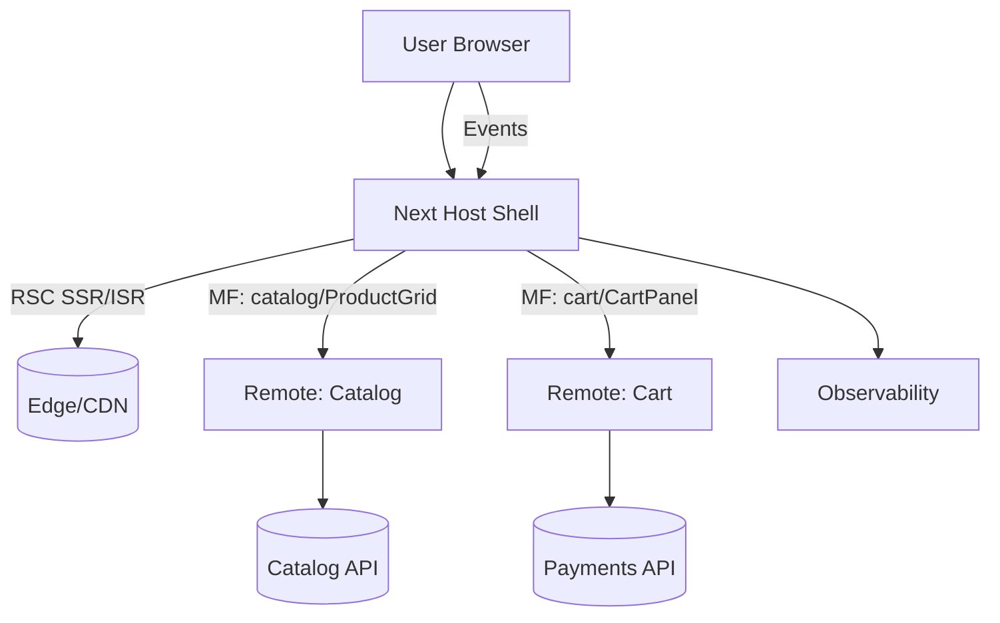
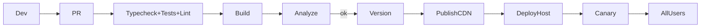

# Core Foundation

### React / react-dom

**Description:** React is the core UI library that allows you to build reusable, component-based interfaces. `react-dom` provides DOM-specific rendering methods. Together, they form the backbone of almost every modern frontend app. React emphasizes declarative UI with hooks for state and lifecycle.
**Example:**

```tsx
import { useState } from 'react';
export default function Counter() {
  const [count, setCount] = useState(0);
  return <button onClick={() => setCount(count + 1)}>{count}</button>;
}
```

**Use cases:** Any UI project — from landing pages to enterprise dashboards.

---

### Next.js

**Description:** Next.js is a full-stack React framework. It adds file-based routing, server-side rendering (SSR), static site generation (SSG), and edge rendering. It comes with a built-in API layer, optimized image handling, and hybrid rendering.
**Example:**

```tsx
// app/page.tsx
export default function Home() {
  return <h1>Hello Next.js</h1>;
}
```

**Use cases:** SEO-focused sites, SaaS dashboards, hybrid apps mixing client + server rendering.

---

### Vite

**Description:** Vite is a fast dev server and bundler. It uses native ES modules in dev and Rollup for builds. With instant HMR (Hot Module Replacement), it speeds up developer feedback loops. It integrates well with React, Vue, and other frameworks.
**Example:**

```json
"scripts": { "dev": "vite", "build": "vite build" }
```

**Use cases:** SPAs, React apps, admin panels — wherever build speed matters.

---

### TypeScript

**Description:** TypeScript is a superset of JavaScript with static typing. It improves developer productivity by catching errors at compile time and enhancing IDE autocompletion. It integrates deeply with React for type-safe props and state.
**Example:**

```ts
type User = { id: string; name: string }
function greet(u: User) { console.log(u.name) }
```

**Use cases:** Any medium-to-large scale project where correctness and refactor safety are critical.

---

### Turbo + pnpm

**Description:** Turbo is a monorepo build system that caches tasks across packages. pnpm is a fast package manager with symlinked node\_modules. Together they speed up large multi-app development by avoiding duplicate work and enforcing efficient installs.
**Example:**

```bash
turbo run build --filter=app
pnpm install
```

**Use cases:** Multi-project repositories (admin + client apps + UI kits).

---

# Data & APIs

### Axios

**Description:** Axios is an HTTP client with a promise-based API. It supports interceptors for request/response, automatic JSON transforms, and cancellation tokens. It simplifies API integration compared to fetch.
**Example:**

```ts
import axios from 'axios';
const api = axios.create({ baseURL: '/api' });
const { data } = await api.get('/users');
```

**Use cases:** REST APIs, authenticated requests, handling errors globally.

---

### React Query / @tanstack/react-query

**Description:** React Query manages server state. It caches, retries, deduplicates, and keeps data in sync. It solves the complexity of data fetching in React by abstracting “loading/error/success” boilerplate.
**Example:**

```tsx
const { data, isLoading } = useQuery({
  queryKey: ['users'],
  queryFn: () => fetch('/api/users').then(r => r.json())
});
```

**Use cases:** Dashboards, infinite scroll, optimistic updates, offline support.

---

### GraphQL & Apollo Client

**Description:** GraphQL is a query language for APIs. Apollo Client provides caching, query batching, and React hooks to work with GraphQL schemas. It normalizes data and allows declarative queries.
**Example:**

```tsx
const GET_USER = gql`{ me { id name } }`
const { data } = useQuery(GET_USER)
```

**Use cases:** Complex apps with many nested relationships (e.g., SaaS dashboards).

---

### graphql-request

**Description:** A lightweight GraphQL client. Unlike Apollo, it doesn’t have caching — just sends queries/mutations. Good for small apps or server-side scripts.
**Example:**

```ts
import { request } from 'graphql-request';
const data = await request('/api/graphql', `{ users { id } }`);
```

**Use cases:** Scripts, static generation, smaller apps.

---

### qs

**Description:** A querystring parser and stringifier. Supports nested objects unlike `URLSearchParams`.
**Example:**

```ts
import qs from 'qs';
const str = qs.stringify({ filter: { name: 'John' } });
// "filter[name]=John"
```

**Use cases:** Building complex API query strings (filters, sorts, pagination).

---

# State Management

### Redux / Redux Toolkit

**Description:** Redux is a predictable state container. Redux Toolkit simplifies reducers, middleware, and store setup. With DevTools, time-travel debugging becomes possible.
**Example:**

```ts
const counter = createSlice({
  name: 'counter', initialState: 0,
  reducers: { inc: s => s + 1 }
});
```

**Use cases:** Large apps where state is shared across many components.

---

### MobX / mobx-react

**Description:** MobX is an observable-based state library. Changes automatically propagate to observers. It uses less boilerplate than Redux.
**Example:**

```ts
const store = observable({ count: 0 })
autorun(() => console.log(store.count))
```

**Use cases:** Apps with deeply nested state or reactive models.

---

### Zustand

**Description:** Zustand is a minimal state manager with a hook-based API. No boilerplate, just a store function.
**Example:**

```ts
const useBear = create(set => ({ count: 0, inc: () => set(s => ({ count: s.count+1 })) }))
```

**Use cases:** Modals, settings, or small global state without Redux.

---

### Jotai

**Description:** Jotai is an atomic state manager. Each piece of state is an atom; components subscribe to atoms directly. It’s simpler than Redux and more granular than Zustand.
**Example:**

```ts
const countAtom = atom(0);
const [count, setCount] = useAtom(countAtom);
```

**Use cases:** Apps needing fine-grained subscriptions (forms, editors).

---

# Forms & Validation

### React Hook Form

**Description:** A performant form library using uncontrolled inputs. Minimal re-renders, works with validation resolvers.
**Example:**

```tsx
const { register, handleSubmit } = useForm();
<form onSubmit={handleSubmit(console.log)}>
  <input {...register('email')} />
</form>
```

**Use cases:** Large forms, wizards, dynamic fields.

---

### Zod

**Description:** A TypeScript-first schema validation library. Parses and validates data at runtime and infers TS types.
**Example:**

```ts
const User = z.object({ email: z.string().email() })
```

**Use cases:** API input validation, form schemas, server-side validation.

---

### Yup

**Description:** Similar to Zod but schema-based. Widely used with Formik.
**Example:**

```ts
const schema = yup.object().shape({ email: yup.string().email() })
```

**Use cases:** Legacy projects; schema validation with async checks.

---

### Formik

**Description:** A form library with controlled inputs and built-in validation.
**Use cases:** Predecessor to React Hook Form; still used in enterprise codebases.

---

# UI Kits & Styling

### Ant Design (antd)

**Description:** A design system + React component library with enterprise-ready UI (tables, modals, forms).
**Example:**

```tsx
<Button type="primary">Click</Button>
```

**Use cases:** Admin dashboards, data-heavy apps.

---

### Tailwind CSS

**Description:** Utility-first CSS framework. Classes for spacing, colors, typography allow rapid prototyping.
**Example:**

```tsx
<div className="grid gap-4 p-6 rounded-2xl shadow">Card</div>
```

**Use cases:** Design systems, marketing sites, apps needing consistency.

---

### Styled-components

**Description:** CSS-in-JS solution using tagged template literals.
**Example:**

```tsx
const Btn = styled.button`padding:10px; border-radius:8px;`
```

**Use cases:** Component-level theming; legacy CRA projects.

---

### Headless UI / Radix UI

**Description:** Headless component libraries providing unstyled, accessible primitives. Pair well with Tailwind.
**Example:** Dialog, menu, popover with built-in accessibility.
**Use cases:** Custom design systems, accessibility-first UIs.

---

### Lucide-react / React-icons / FontAwesome

**Description:** Icon libraries for consistent vector icons.
**Use cases:** Buttons, menus, status indicators.

---

# Charts, Maps & Visualization

### Recharts

**Description:** Recharts is a charting library built with React components and D3 under the hood. It focuses on composability — you build charts by combining primitives (`<LineChart>`, `<XAxis>`, `<Tooltip>`). Its declarative syntax makes it intuitive for React devs.
**Example:**

```tsx
<LineChart width={400} height={200} data={[{ x: 1, y: 2 }]}>
  <XAxis dataKey="x" />
  <Line type="monotone" dataKey="y" stroke="#8884d8" />
</LineChart>
```

**Use cases:** Dashboards, KPIs, time series, financial data.

---

### Chart.js + react-chartjs-2

**Description:** Chart.js is a vanilla JS charting library with a React wrapper (`react-chartjs-2`). It supports line, bar, radar, pie, and custom charts. The React wrapper exposes them as components.
**Example:**

```tsx
<Bar data={{ labels:['A'], datasets:[{ label:'Score', data:[12] }] }} />
```

**Use cases:** Reports, analytics dashboards, visualizing survey data.

---

### ApexCharts + react-apexcharts

**Description:** ApexCharts is highly interactive and supports advanced features (zooming, tooltips, mixed charts). The React wrapper integrates easily.
**Example:**

```tsx
<Chart type="line" series={[{ data:[1,2,3] }]} />
```

**Use cases:** Financial apps, dashboards needing zoom/pan.

---

### amCharts

**Description:** amCharts is a commercial chart library supporting maps and rich visualizations. Used where polished, presentation-quality charts are needed.
**Use cases:** Infographics, admin dashboards.

---

### Victory

**Description:** Victory provides React-native compatible charts with a declarative API. Its focus is flexibility and animations.
**Use cases:** Cross-platform dashboards (web + RN).

---

### Google Map React / @react-google-maps/api / @googlemaps/js-api-loader

**Description:** These packages integrate Google Maps into React apps. `google-map-react` renders maps as React components. `@react-google-maps/api` is an official wrapper with hooks and components. `@googlemaps/js-api-loader` loads Google Maps JS SDK efficiently.
**Example:**

```tsx
<GoogleMap center={{lat:0,lng:0}} zoom={4} />
```

**Use cases:** Store locators, logistics tracking, delivery apps.

---

### react-big-calendar / react-calendar / react-datepicker

**Description:** These are UI components for calendars and scheduling. `react-big-calendar` is event-driven like Google Calendar. `react-datepicker` is lightweight for date inputs.
**Use cases:** Booking systems, HR leave apps, project timelines.

---

---

# Editors & Media

### Draft.js + react-draft-wysiwyg

**Description:** Draft.js is a framework for building rich text editors, created by Facebook. `react-draft-wysiwyg` wraps it with a toolbar and ready-to-use UI.
**Example:**

```tsx
<Editor editorState={state} onEditorStateChange={setState} />
```

**Use cases:** Blog editors, comments, email composition.

---

### Quill / React Quill

**Description:** Quill is a popular WYSIWYG editor. `react-quill` provides a React binding. It’s simpler to set up than Draft.js.
**Use cases:** Notes, CMS text fields.

---

### SunEditor + suneditor-react

**Description:** Lightweight WYSIWYG with a rich toolbar. Often used when Draft/Quill feel heavy.
**Use cases:** Newsletters, feedback forms, admin panels.

---

### React Markdown + remark-gfm

**Description:** `react-markdown` renders Markdown content safely into React. With `remark-gfm`, you get GitHub-style features like task lists and tables.
**Example:**

```tsx
<ReactMarkdown># Hello World</ReactMarkdown>
```

**Use cases:** Knowledge bases, chat messages, docs.

---

### React Player / hls.js / react-h5-audio-player

**Description:** Media playback libraries. `react-player` supports YouTube, Vimeo, MP4, HLS. `hls.js` enables adaptive video streaming. `react-h5-audio-player` is a customizable audio UI.
**Use cases:** E-learning, podcasts, live streams.

---

### React-to-Print / jspdf / html2canvas / html2pdf.js

**Description:** Export and printing utilities. `react-to-print` prints React components. `jspdf` generates PDFs programmatically. `html2canvas` converts DOM to images. `html2pdf.js` combines HTML + canvas into PDFs.
**Use cases:** Invoices, certificates, downloadable reports.

---

### qrcode / qrcode.react / react-qr-reader

**Description:** QR code generation and scanning. `qrcode.react` renders as SVG/Canvas. `react-qr-reader` uses camera input.
**Use cases:** Event tickets, payments, login with QR.

---

---

# Dates, Time & i18n

### Day.js

**Description:** A modern alternative to Moment.js. Small API, immutable, chainable.
**Example:**

```ts
dayjs().add(1,'day').format('YYYY-MM-DD')
```

**Use cases:** Date formatting, relative time, timezones with plugins.

---

### Date-fns

**Description:** Functional library with tree-shakable date utilities. Each function is standalone (`addDays`, `format`).
**Example:**

```ts
import { format } from 'date-fns';
format(new Date(), 'dd/MM/yyyy');
```

**Use cases:** Apps needing small bundles and modern FP style.

---

### Moment.js + moment-timezone

**Description:** Legacy but still widely used. Provides rich formatting, parsing, and timezone support. Heavy compared to dayjs/date-fns.
**Use cases:** Legacy projects.

---

### i18next + react-i18next

**Description:** i18next is an internationalization framework. It manages translation dictionaries, pluralization, and fallbacks. `react-i18next` provides hooks like `useTranslation()`.
**Example:**

```tsx
const { t } = useTranslation();
<p>{t('welcome')}</p>
```

**Use cases:** Multi-language apps, RTL support.

---

### country-state-city / countries-and-timezones / libphonenumber-js

**Description:** Helpers for geographic and phone data. Prebuilt lists of countries/states and timezone data. `libphonenumber-js` validates and formats numbers.
**Use cases:** Address forms, phone verification, shipping modules.

---

---

# Authentication & Security

### Next-Auth

**Description:** Authentication for Next.js. Provides OAuth, credentials, email magic links. Handles JWT/session internally.
**Example:**

```ts
const session = await getServerSession(authOptions)
```

**Use cases:** User login, Google/GitHub login, passwordless auth.

---

### @azure/msal-browser / @azure/msal-react

**Description:** Microsoft Authentication Library for browser and React. Supports OAuth 2.0, OpenID Connect, SSO with Entra ID (Azure AD).
**Use cases:** Enterprise dashboards, internal portals.

---

### jsonwebtoken (JWT)

**Description:** Library for signing and verifying JWTs. Used server-side in APIs.
**Example:**

```ts
jwt.sign({ userId:1 }, 'secret')
```

**Use cases:** Token-based auth, stateless sessions.

---

### react-facebook-login / react-google-login / @google-pay/button-react

**Description:** Social and payment login SDK wrappers.
**Use cases:** One-click auth, Google Pay integration.

---

### react-secure-storage / universal-cookie / react-cookie

**Description:** Client-side storage utilities with encryption and cookie APIs.
**Use cases:** Securely storing tokens, managing sessions.

---

---

# File Handling & Uploads

### PapaParse + react-papaparse

**Description:** CSV parsing library. Converts CSV into arrays/objects. React wrapper adds hooks.
**Example:**

```ts
Papa.parse(file, { complete: r => console.log(r.data) })
```

**Use cases:** Import/export spreadsheets.

---

### Read-excel-file / json-as-xlsx

**Description:** Read `.xlsx` files client-side and export JSON → Excel.
**Use cases:** Bulk data imports, reports.

---

### Uploadthing / React Dropzone

**Description:** File upload solutions. `react-dropzone` provides drag-and-drop input. Uploadthing integrates storage (Cloudflare R2, S3).
**Use cases:** Upload avatars, docs, images.

---

### Sharp

**Description:** Node library for image manipulation (resize, crop, compress). Often used in Next.js API routes.
**Use cases:** Generating thumbnails, optimizing uploads.

---

### Dompurify + html-react-parser

**Description:** Sanitize raw HTML for XSS safety. `html-react-parser` renders HTML strings as React components.
**Use cases:** User-generated content.

---

---

# Notifications & Realtime

### React-Toastify / Sonner / React-Hot-Toast

**Description:** Lightweight toast notification libraries. Provide customizable pop-ups for success/error/info.
**Example:**

```ts
toast.success('Saved!')
```

**Use cases:** Form feedback, background task updates.

---

### Socket.io-client / Pusher-js / Liveblocks / Yjs

**Description:** Real-time libraries. `socket.io-client` handles bidirectional websockets. `pusher-js` is hosted pub/sub. `liveblocks` and `yjs` provide presence and CRDT collaboration.
**Use cases:** Chats, multiplayer docs, collaborative whiteboards.

---

### @chatscope/chat-ui-kit-react

**Description:** A ready-made chat UI kit with message bubbles, typing indicators.
**Use cases:** Customer support chat, team chat modules.

---

---

# Testing, Linting & Tooling

### Jest + Testing Library (@testing-library/react, jest-dom, user-event)

**Description:** Jest is a JS test runner. Testing Library provides React-focused utilities for testing components from the user’s perspective.
**Example:**

```tsx
render(<Button/>);
expect(screen.getByRole('button')).toBeInTheDocument();
```

**Use cases:** Unit tests, integration tests.

---

### Vitest

**Description:** A fast Vite-native test runner. API is Jest-compatible.
**Use cases:** Projects using Vite for bundling.

---

### ESLint + Prettier

**Description:** ESLint is a linter enforcing best practices. Prettier auto-formats code. Combined with Husky and lint-staged, they ensure consistent commits.
**Example:**

```json
"lint-staged": { "*.{js,ts,tsx}": "prettier --write" }
```

**Use cases:** All repos — maintain code quality.

---

### Husky + lint-staged

**Description:** Husky manages Git hooks. lint-staged runs linters/formatters on staged files before commit.
**Use cases:** Prevent broken code from entering the repo.

---

---

# Miscellaneous Utilities

### Lodash

**Description:** Utility library with functions for arrays, objects, and strings.
**Example:**

```ts
_.debounce(fn, 300)
```

**Use cases:** Data transforms, performance optimizations.

---

### UUID

**Description:** Generate unique identifiers.
**Example:**

```ts
import { v4 as uuid } from 'uuid';
uuid();
```

**Use cases:** Database IDs, React keys.

---

### clsx + class-variance-authority

**Description:** Tools for conditionally joining class names. CVA adds typed variants.
**Example:**

```ts
clsx('btn', isActive && 'btn-active')
```

**Use cases:** Tailwind projects, design systems.

---

### Ahooks / React-use

**Description:** Collections of useful React hooks (debounce, localStorage, event listeners).
**Example:**

```ts
const [value, setValue] = useLocalStorage('key', 'default')
```

**Use cases:** Save time with common utilities.

---

### Framer Motion

**Description:** Declarative animation library. Supports gestures, layout animations, variants.
**Example:**

```tsx
<motion.div animate={{ opacity:1 }}>Hello</motion.div>
```

**Use cases:** Smooth transitions, modals, interactive dashboards.

awesome — adding the missing **3D stack** with paragraph-level explanations + a crisp “how to wire it into your JS Modal Widget / Extension” approach.

---

# 3D / WebGL packages (paragraph-level)

### three

**Description:** Three.js is the core WebGL engine. It gives you scenes, cameras, lights, materials, geometry helpers, loaders, and the render loop you need to draw 3D in the browser without touching low-level WebGL directly. It’s mature, well-documented, and broadly compatible.
**Example:** (vanilla three)

```ts
const scene = new THREE.Scene();
const camera = new THREE.PerspectiveCamera(50, w/h, 0.1, 1000);
const renderer = new THREE.WebGLRenderer({ antialias: true });
renderer.setSize(w, h);
document.body.appendChild(renderer.domElement);
renderer.setAnimationLoop(() => { renderer.render(scene, camera); });
```

**Use cases:** Any browser-based 3D: product viewers, configurators, AR/VR entry points.

---

### @react-three/fiber (R3F)

**Description:** A React renderer for three.js that lets you build scenes in **JSX** and manage them with **hooks** instead of imperative calls. It ties three’s render loop to React’s lifecycle and supports **suspense**, making async model loading and code-splitting natural.
**Example:**

```tsx
import { Canvas } from '@react-three/fiber';
function Box(){ return <mesh><boxGeometry/><meshStandardMaterial/></mesh> }
export default () => <Canvas camera={{ position:[2,2,3] }}><ambientLight/><Box/></Canvas>;
```

**Use cases:** Product viewers inside React apps, interactive 3D UIs in modals/overlays.

---

### @react-three/drei

**Description:** A grab-bag of battle-tested helpers for R3F: **OrbitControls**, loaders (`useGLTF`), environment presets, staging/lighting helpers, text, bounds fitting, and more. It removes tons of boilerplate and standardizes best practices.
**Example:**

```tsx
import { Canvas } from '@react-three/fiber'
import { OrbitControls, useGLTF } from '@react-three/drei'
function Model(){ const { scene } = useGLTF('/shoe.glb'); return <primitive object={scene} /> }
export default () => <Canvas><ambientLight/><Model/><OrbitControls/></Canvas>;
```

**Use cases:** Fast model loading, camera controls, environment lighting with minimal code.

---

### three/examples/jsm/loaders/GLTFLoader (via drei’s `useGLTF`)

**Description:** The standard loader for **.gltf/.glb** assets (PBR materials, animations, skins). In React you’ll typically use `useGLTF` from **drei**, which caches results and works with React Suspense. Supports **Draco/Meshopt** compressed assets for much smaller downloads.
**Example:**

```tsx
import { useGLTF } from '@react-three/drei'
const Shoe = () => { const { scene } = useGLTF('/shoe-draco.glb'); return <primitive object={scene} /> }
```

**Use cases:** Loading photoreal products, avatars, animated sequences.

---

### @react-three/cannon (physics, optional)

**Description:** Bridges **cannon-es** physics into R3F. You declare rigid bodies and constraints as React components; it handles simulation and updates meshes. Great for collisions, gravity, stacking, and physically-based interactions.
**Example:**

```tsx
import { Physics, RigidBody } from '@react-three/cannon'
<Canvas>
  <ambientLight/>
  <Physics gravity={[0,-9.81,0]}>
    <RigidBody><mesh><boxGeometry/><meshStandardMaterial/></mesh></RigidBody>
  </Physics>
</Canvas>
```

**Use cases:** Dropping items into a cart, snapping/stacking UX, playful interactions.

---

### @react-three/postprocessing (optional)

**Description:** React bindings for **postprocessing** effects (bloom, SSAO, vignette). Lets you add cinematic polish without touching shader plumbing.
**Use cases:** Premium “hero” shots, subtle depth/contrast bumps in a viewer.

---

### leva (optional)

**Description:** A tiny on-screen control panel for live-tweaking numbers, colors, toggles during dev/demos. Zero build-time config, instant feedback for designers and PMs.
**Example:**

```tsx
import { useControls } from 'leva'
const { intensity } = useControls({ intensity: { value: 1, min:0, max:5 }})
<directionalLight intensity={intensity} />
```

**Use cases:** Quickly dialing lights/camera, exposing product options for QA.

---

### react-konva / fabric.js (optional – for whiteboard overlays)

**Description:** If you need 2D drawing (annotations, arrows, highlights) on top of 3D, these canvas libs make it easy to layer vector UI or notes alongside your R3F canvas.
**Use cases:** Annotated product viewers, dimensioning, feedback flows.

---

# How to use them in your **JS Modal Widget**

### Install

```bash
pnpm add three @react-three/fiber @react-three/drei
# optional:
pnpm add @react-three/cannon @react-three/postprocessing leva
```

### Minimal viewer inside your modal (Shadow DOM safe)

```tsx
// WidgetModal.tsx
import { Canvas } from '@react-three/fiber'
import { OrbitControls, useGLTF, Environment } from '@react-three/drei'

function Model(){ const { scene } = useGLTF('/models/sku-123.glb'); return <primitive object={scene} /> }

export default function WidgetModal({ open }: { open: boolean }) {
  if (!open) return null
  return (
    <div id="obo-modal" role="dialog" aria-modal className="fixed inset-0 grid place-items-center bg-black/50">
      <div className="w-[90vw] max-w-[720px] h-[60vh] rounded-2xl overflow-hidden bg-white">
        <Canvas camera={{ position: [2, 1.5, 3], fov: 45 }}>
          <ambientLight intensity={0.5} />
          <directionalLight position={[5,5,5]} intensity={1} />
          <Suspense fallback={null}>
            <Environment preset="city" />
            <Model />
          </Suspense>
          <OrbitControls enableDamping makeDefault />
        </Canvas>
      </div>
    </div>
  )
}
```

### Approach & tips (widget)

* **Bundle budget:** keep the viewer path **lazy-loaded** (`import('./WidgetModal')` on open). Ship a Draco/Meshopt-compressed **.glb** to keep assets tiny.
* **Shadow DOM / iframe:** mount the React root inside a Shadow Root to isolate Tailwind/host styles; the Canvas works fine there.
* **SSR:** the widget is client-only; guard any `window` usage. With R3F, render only after mount to avoid SSR mismatches.
* **Sizing:** wrap the `<Canvas>` in a container that uses **ResizeObserver** (R3F handles this automatically) so it scales with the modal.
* **Cleanup:** unmount the modal to release the WebGL context; dispose geometries/materials if you manage them manually.
* **Preload:** use `useGLTF.preload('/models/sku.glb')` when the user hovers the CTA to make first open instant.
* **Accessibility:** keep focus-trap on the modal; expose keyboard shortcuts (Esc to close, arrows to rotate optional).

---

# How to use them in your **Browser Extension**

### Content script injection + popup viewer

* **Content script** injects a CTA (same as widget). On click, it **creates a container** (optionally Shadow DOM) and mounts the React viewer (same `<Canvas>`).
* **Popup UI** can host a smaller, **static thumbnail** (pre-rendered image) to keep popup snappy; open the full **content-script modal** for real 3D.
* **Permissions / CSP:** avoid external scripts; bundle models or load from allowed origins defined in `host_permissions`.
* **Bundle size:** code-split the 3D viewer out of the always-running background and popup to keep MV3 **service worker cold starts** fast.

### Minimal content-script mount

```ts
// content-script.tsx
const host = document.createElement('div')
host.id = 'obo-3d-root'
const shadow = host.attachShadow({ mode: 'open' })
document.body.appendChild(host)
const root = createRoot(shadow) // React 18 root
root.render(<WidgetModal open />) // reuse the same component as widget path
```

---

# Asset pipeline (recommended)

* Export GLB with **Draco** compression from your DCC tool (or run `gltf-transform draco`).
* Serve with long cache headers; version assets alongside widget versions.
* If you use **Meshopt**, add the decoder WASM and register it before loading models.
* For multiple SKUs, **lazy-load per SKU** and warm cache based on page signals (e.g., “user viewed gallery”).

---

# Performance checklist (quick)

* Turn on **`powerPreference: "high-performance"`** in WebGLRenderer (R3F accepts `gl` props via `<Canvas gl={{ powerPreference:'high-performance' }} />`).
* Use **lights sparingly**; prefer an **HDRI environment** (`<Environment preset="city" />`) over many dynamic lights.
* Cap **pixelRatio** on mobile: `dpr={[1, 1.5]}`.
* Freeze controls/animations when modal is hidden; **unmount** to free GPU memory.
* Keep shaders/effects minimal (use postprocessing only if it pays off visually).

---

# Optional add-ons 

* **@react-three/gltfjsx** → converts GLB into a typed JSX component for tree-shaking and selective material tweaks.
* **@react-three/rapier** → faster, modern physics alternative to cannon-es.
* **Stats.js / r3f-perf** → quick FPS and GPU timings in dev.
* **gsap / framer-motion-3d** → camera/mesh tweening for hero transitions.
---

# React • Next.js • Gatsby Architecture & Micro‑Frontend Playbook (Atomic‑First)

> A practical, atomic‑first architecture guide with diagrams, folder blueprints, and patterns for React, Next.js (App Router, RSC), Gatsby, and Micro‑Frontends.

---

## 0) Opinionated Principles

* **Atomic‑First UI**: Atoms → Molecules → Organisms → Templates → Pages. Co‑locate tests, stories, and styles.
* **Feature/Domain Ownership**: Slice by feature/domain; share via stable interfaces.
* **Server‑Lean**: Push data fetching and heavy transforms to the server where possible (RSC/SSR/ISR). Hydrate only what’s interactive.
* **Edge‑Aware**: Prefer CDN/Edge for static/ISR routes, server actions for mutations.
* **Observable by Default**: Tracing, metrics, and structured logs wired in from Day‑1.
* **Contract‑Driven**: Type‑safe schema, API clients, and versioned contracts.
* **Performance Budgets**: < 100ms TTFB (edge‑SSR), < 200KB initial JS (gz), LCP < 2.5s on 4G, CLS < 0.1, INP < 200ms.

---

## 1) Atomic Design in Practice

### 1.1 Folder Shape (framework‑agnostic)

```
src/
  app/                       # app-wide scaffolding (providers, routing shells)
  design-system/             # tokens, themes, primitives (atoms)
    atoms/
    molecules/
    organisms/
    templates/
  features/
    cart/
      api/                   # feature-specific API calls, server actions
      components/            # feature organisms/molecules
      hooks/
      state/
      routes/                # route segments (Next) or pages (React/Gatsby)
      tests/
  entities/                  # domain models (user, product, order)
  shared/
    api/                     # base clients (REST/GraphQL), interceptors
    lib/                     # cross-cutting utils
    ui/                      # cross-feature reusable atoms/molecules
    state/                   # global stores (e.g., auth)
    config/
    types/
```

### 1.2 Atomic Checklist

* **Atoms**: no business logic; pure presentational; receive props.
* **Molecules**: compose atoms; expose minimal surface; aria‑ready.
* **Organisms**: feature‑aware; may read from hooks/stores; still avoid API calls.
* **Templates**: layout/skeleton; fetch wrappers only in server shells.
* **Pages**: wire data + template; no deep business logic.

---

## 2) React (Vite SPA) Architecture

### 2.1 Lifecycle Diagram (Client SPA)

```mermaid
flowchart LR
  A[Route change] --> B[Query client (cache?)]
  B -->|HIT| C[Render atoms/molecules]
  B -->|MISS| D[Fetch via shared/api]
  D --> E[Normalize→entities]
  E --> F[Update Zustand/RTK Query]
  F --> C
```

### 2.2 Suggested Stack

* **Build**: Vite + TS + SWC
* **Routing**: React Router v6+ (code‑split routes)
* **Data**: TanStack Query (cache/time‑based revalidation)
* **State**: Zustand/Redux Toolkit (thin global state)
* **Styling**: Tailwind + CSS Modules; shadcn/ui for base primitives
* **Forms**: React Hook Form + Zod
* **Testing**: Vitest + RTL + MSW (network mocks)

### 2.3 SPA Folder Example

```
src/
  main.tsx
  router/
    index.tsx                # route objects + lazy()
  shared/api/http.ts         # axios/fetch wrapper with interceptors
  shared/state/queryClient.ts
  features/profile/
    routes/ProfilePage.tsx
    components/ProfileCard.tsx
    api/useProfileQuery.ts
```

---

## 3) Next.js (App Router + React Server Components)

### 3.1 What Goes Where

* **Server Components** (`app/**/page.tsx`, `layout.tsx`): data fetching (DB/SDK), heavy transforms, HTML streaming.
* **Client Components** (`"use client"`): interactivity (event handlers, local state), animations.
* **Server Actions**: mutate data from client forms without bespoke API routes.
* **Route Handlers** (`app/api/*/route.ts`): when you need explicit HTTP endpoints.

### 3.2 Request Flow Diagram (SSR/ISR)



### 3.3 Next App Router Layout

```
app/
  layout.tsx                 # shells/providers (Theme, QueryClientProvider)
  (marketing)/               # parallel/optional routes
    layout.tsx
    page.tsx
  dashboard/
    layout.tsx
    page.tsx                 # server component (list)
    actions.ts               # server actions (mutations)
    [id]/
      page.tsx               # server component (detail)
  api/
    products/route.ts        # explicit REST endpoints
```

### 3.4 Patterns

* **Segment‑Scoped Providers**: keep client providers at the smallest tree.
* **RSC + TanStack Query Hydration**: fetch on server, hydrate cache to clients that need reactivity.
* **Edge Runtime**: `export const runtime = 'edge'` for low‑latency read routes.
* **ISR with Revalidate Tags**: `revalidatePath('/dashboard')` post‑mutation.

---

## 4) Gatsby Architecture

### 4.1 When to Use

* Content‑heavy sites with build‑time GraphQL, sharp images, and predictable publishing cadence.

### 4.2 Data Flow

```mermaid
flowchart TB
  sources[(CMS/MD/REST)] --> gatsbyNode[createSchemaCustomization]
  gatsbyNode --> graphql[GraphQL data layer]
  graphql --> build[SSG Build]
  build --> public[/public (HTML, assets)/]
  public --> CDN
```

### 4.3 Folder

```
src/
  pages/             # file-based routes (static)
  templates/         # programmatic pages via createPages
  components/        # atomic DS
  features/          # optional feature slices
  gatsby-ssr.js      # SSR hooks
  gatsby-browser.js  # client hooks (wrapRootElement)
```

### 4.4 Patterns

* Prefer **File System Route API** for dynamic content.
* Use **Deferred Static Generation (DSG)** for long tails.
* Incremental builds with Gatsby Cloud/Netlify for content spikes.

---

## 5) Micro‑Frontends (MFE)

### 5.1 Topologies



* **Module Federation (Webpack 5)**: runtime‑resolve remote bundles; share libs via `shared` section and version constraints.
* **Single‑SPA**: route‑level orchestration mounting multiple frameworks.
* **Web Components**: framework‑agnostic, encapsulated via Custom Elements; share via event contracts.
* **Iframe MFEs**: strongest isolation, weakest UX/integration; use for untrusted vendors.

### 5.2 Decision Matrix

| Criterion | Module Federation | Single‑SPA | Web Components | Iframe |
| --------- | ----------------- | ---------- | -------------- | ------ |
| DX        | ★★★★☆             | ★★★☆☆      | ★★★☆☆          | ★★☆☆☆  |
| Isolation | ★★★☆              | ★★★        | ★★★★           | ★★★★★  |
| Perf      | ★★★★              | ★★★        | ★★★            | ★★     |
| Polyglot  | ★★                | ★★★★★      | ★★★★★          | ★★★★★  |
| SEO/SSR   | ★★★★ (Next host)  | ★★         | ★★             | ★★     |

### 5.3 Module Federation Minimal Example

**Host (Next.js/React):**

```js
// next.config.js (with webpack)
/** @type {import('next').NextConfig} */
const NextFederationPlugin = require('@module-federation/nextjs-mf');
module.exports = {
  webpack(config) {
    config.plugins.push(
      new NextFederationPlugin({
        name: 'host',
        remotes: {
          catalog: `catalog@https://cdn.example.com/catalog/remoteEntry.js`,
        },
        shared: {
          react: { singleton: true, requiredVersion: false },
          'react-dom': { singleton: true, requiredVersion: false },
        },
      })
    );
    return config;
  },
};
```

**Remote (catalog app):**

```js
// webpack.config.js
const { ModuleFederationPlugin } = require('webpack').container;
module.exports = {
  plugins: [
    new ModuleFederationPlugin({
      name: 'catalog',
      filename: 'remoteEntry.js',
      exposes: {
        './ProductGrid': './src/features/catalog/ProductGrid',
      },
      shared: { react: { singleton: true }, 'react-dom': { singleton: true } },
    }),
  ],
};
```

**Usage in Host:**

```tsx
const ProductGrid = dynamic(() => import('catalog/ProductGrid'));
```

### 5.4 Cross‑App Contracts

* **Events**: `window.dispatchEvent(new CustomEvent('cart:add', { detail }))`
* **Bus**: tiny EventEmitter shared as a singleton via federation `shared`.
* **URL/Routing Contract**: route prefixes per MFE (`/catalog`, `/cart`).
* **Design Tokens**: distribute via CSS variables or a tokens package; avoid duplicating Tailwind configs unless locked.

### 5.5 CI/CD for MFEs



* Use a **manifest/registry** mapping remote names → versioned URLs.
* Add **contract tests**: host consumes remote’s exposed module in CI using `module-federation-runtime` or stub.

---

## 6) Cross‑Cutting Engineering Practices

### 6.1 Type‑Safe Contracts

* OpenAPI/GraphQL schema → generate TS types & clients (or tRPC/Zod if co‑located).
* Enable **strict** TS; never `any` in shared interfaces.

### 6.2 State & Data Guidelines

* **Global**: auth session, feature flags, theme.
* **Server Cache**: RSC fetch memoization; tag‑based revalidate.
* **Client Cache**: TanStack Query for mutations/optimistic UI.
* **Avoid** global mutable state for view‑only params.

### 6.3 Performance & DX

* Bundle split at **route** and **organism** level.
* **Analyze**: `webpack-bundle-analyzer` / `rollup-plugin-visualizer`.
* **Images**: Next `<Image/>`, Gatsby sharp, lazy/hqip.
* **Concurrency**: React 18 Suspense, transitions for route swaps.

### 6.4 Accessibility

* Keyboard traps, focus rings, landmarks, color contrast ≥ 4.5:1.
* Use ARIA patterns in design‑system molecules.

### 6.5 Testing Pyramid

* Unit (atoms/molecules) → Component (organisms) → Contract (API clients) → E2E (routes).
* Tools: Vitest/Jest, RTL, Playwright, MSW.

### 6.6 Observability

* Web Vitals → analytics stream.
* Log context: userId, route, correlationId.
* Frontend traces with OpenTelemetry → backend spans.

---

## 7) Example Blueprints

### 7.1 Design System (Atomic) Example

```
src/design-system/
  atoms/
    Button/
      Button.tsx
      Button.test.tsx
      Button.stories.tsx
      index.ts
  molecules/
    InputField/
  organisms/
    Modal/
  tokens/
    colors.ts
    spacing.ts
    typography.ts
```

### 7.2 Feature Slice Example (Next.js)

```
src/features/checkout/
  components/
    SummaryCard.tsx
    PaymentForm.tsx        # client component
  api/
    actions.ts             # server actions (createPaymentIntent)
  routes/                  # if using custom routing in app/ via re-exports
  state/
    useCheckoutStore.ts
  tests/
```

### 7.3 Data Fetching Patterns

**Next (server):**

```ts
// app/dashboard/page.tsx
import { getOrders } from '@/shared/api/orders';
export default async function Page() {
  const orders = await getOrders(); // runs on server
  return <OrdersTable orders={orders} />; // client table can hydrate
}
```

**React SPA (TanStack Query):**

```ts
const { data, isLoading } = useQuery({
  queryKey: ['orders'],
  queryFn: api.orders.list,
  staleTime: 60_000,
});
```

**Gatsby (page query):**

```graphql
query BlogPost($id: String!) {
  markdownRemark(id: { eq: $id }) {
    frontmatter { title, date }
    html
  }
}
```

---

## 8) Security & Compliance Guardrails

* CSP with `script-src 'self'` + allowed CDNs; nonce for inline scripts (Next `next/script`).
* Sanitize user content (DOMPurify) when dangerously setting HTML.
* Token handling: HttpOnly cookies (SSR friendly); rotate/refresh; never localStorage for high‑risk scopes.
* Dependency hygiene: `npm audit`, SCA, renovate schedules; pin shared lib versions in MFEs.

---

## 9) Micro‑Frontend Play Patterns

### 9.1 Shared UI & Tokens

* Publish `@org/tokens` and `@org/ui` (atoms/molecules). Consumers can wrap to theme.
* Use CSS variables for theming; avoid Tailwind config drift by exporting preset.

### 9.2 Navigation & State

* **URL is the source of truth** across MFEs.
* For cross‑MFE events, define a JSON schema and version (e.g., `cart.add@v2`).

### 9.3 Error Isolation

* Each MFE ships its own error boundary; host displays fallback cards.

---

## 10) Diagrams: Putting It Together

### 10.1 End‑to‑End (Next Host + MFEs)



### 10.2 Build/Release



---

## 11) Architectural Decision Record (ADR) Template

```
# ADR-00X: <Title>
Date: YYYY-MM-DD
Status: Proposed | Accepted | Deprecated
Context: What problem are we solving? Who are users? Constraints?
Decision: The selected approach and why.
Consequences: Positive/negative outcomes, risks, rollbacks.
Alternatives: Options considered and reasons rejected.
Contracts: Interfaces, events, versioning plan.
Monitoring: KPIs, dashboards, alarms.
```

---

## 12) Checklists

### 12.1 PR Checklist

* [ ] Atomic boundaries respected
* [ ] No business logic in components > organisms
* [ ] Server components do the heavy fetch
* [ ] Accessibility annotations present
* [ ] Bundle diff ≤ budget
* [ ] Tests: unit + at least 1 RTL per organism
* [ ] Telemetry: page view + key action span

### 12.2 Release Checklist (MFEs)

* [ ] Remote version bumped & published
* [ ] Contract tests green (host ↔ remote)
* [ ] Smoke E2E on canary
* [ ] Observability dashboards checked
* [ ] Rollback plan documented

---

## 13) References & Packages (suggested)

* Routing/Data: Next App Router, TanStack Query, React Router
* Forms: RHF + Zod
* State: Zustand, Redux Toolkit (when needed)
* Styling: Tailwind, shadcn/ui, CSS Modules
* Images: Next/Image, Gatsby sharp
* Federation: `@module-federation/nextjs-mf`, `webpack.container` MF plugin, `single-spa`
* Testing: Vitest/Jest, RTL, Playwright, MSW
* Observability: OpenTelemetry Web, Sentry

---

### Appendix A: Token Strategy

* Export design tokens as **CSS variables** + TS maps; compile Tailwind preset.
* Dark mode via `data-theme` on `<html>`; components consume vars, not raw hex.

### Appendix B: Performance Budgets (defaults)

* HTML: < 50KB, CSS: < 100KB, JS: < 200KB initial
* Image policy: AVIF/WebP, responsive srcset, LQIP/HQIP

got it—here’s a practical, engineer-ready guide to Node.js + popular backend frameworks with “when to use what,” trade-offs, and baseline tech specs you can adopt on day one.

---

# Node.js tech spec (baseline)

* **Runtime**: Node.js LTS (v20.x or v22.x). Enable `--experimental-strip-types` only if you truly need TS at runtime; otherwise compile TS → JS.
* **Language**: TypeScript 5.x (strict mode, path aliases).
* **Package manager**: `pnpm` (fast, workspace-friendly). Alt: `npm` if you need zero tooling friction in CI.
* **HTTP server**: Prefer **Fastify** engine where possible (even under Nest) for perf + schema.
* **Process & deploy**: Docker (distroless or Alpine), Health checks (`/healthz`), graceful shutdown (SIGTERM), run as non-root. Use PM2 only for bare-metal.
* **Config**: `dotenv` at dev; env-driven config with zod validation at boot.
* **Logging**: **Pino** (JSON logs, req-id correlation), log sampling for noisy paths.
* **Metrics/Tracing**: OpenTelemetry (OTLP exporter) + Prometheus metrics; add RED/USE dashboards in Grafana.
* **DB access**: **Prisma** (for DX + safety) or **TypeORM** (if you need decorators/entities in Nest). For high-throughput analytics, consider **Kysely** + raw SQL.
* **Cache/Queues**: Redis 7 (BullMQ for jobs, ioredis for cache). Kafka/NATS for event bus at scale.
* **Testing**: Vitest/Jest (unit), Supertest (HTTP), Pact (contract), k6 (load).
* **Security**: Helmet (or Fastify helmet), rate limiters, CSRF where relevant, OWASP top-10 checks in CI.
* **Docs**: OpenAPI/Swagger (auto-gen), Postman collections from OpenAPI.
* **CI/CD**: Lint (ESLint), format (Prettier), typecheck, unit/integration, container build, SCA (npm audit, Snyk), SBOM (CycloneDX).

---

# Frameworks at a glance (decision matrix)

| Framework                    | Perf | DX & Structure                                    | Typing               | Best For                                       | Avoid If                                   |
| ---------------------------- | ---- | ------------------------------------------------- | -------------------- | ---------------------------------------------- | ------------------------------------------ |
| **Express**                  | ★★☆  | Minimal, unopinionated                            | OK (community types) | Legacy, tiny services, learning                | You need schemas, plugins, speed, or DI    |
| **Fastify**                  | ★★★  | Plugin-first, JSON-schema, great perf             | Strong               | Low-latency APIs, gateways, serverless         | You want opinionated MVC or DI out-of-box  |
| **NestJS (Fastify adapter)** | ★★☆  | Enterprise structure (modules, DI, pipes, guards) | Strong               | Large teams, microservices, standards, testing | Ultra-lean functions or very tiny apps     |
| **Koa**                      | ★★☆  | Middleware-centric, modern Express                | Good                 | Custom stacks needing fine control             | You want batteries-included or scaffolding |
| **hapi**                     | ★★☆  | Config-driven, robust validation                  | Good                 | APIs with strict policies, plugins             | You need massive community & examples      |
| **AdonisJS**                 | ★★☆  | “Laravel-for-Node” full-stack MVC                 | Strong               | CRUD apps with conventions (Auth, ORM)         | Microservices or custom protocol needs     |
| **FeathersJS**               | ★★☆  | Service-oriented, sockets baked-in                | Good                 | Real-time CRUD over REST/WS quickly            | Complex domain logic/DDD                   |
| **LoopBack 4**               | ★★☆  | Model-first, OpenAPI-first                        | Good                 | Auto CRUD APIs, integration layers             | You prefer code-first, minimal runtime     |

> Thumb rule:
>
> * Need **speed + low overhead** → **Fastify**.
> * Need **team structure, decorators, DI, microservices** → **NestJS (with Fastify adapter)**.
> * Need **convention-heavy MVC** → **AdonisJS**.
> * Incremental **legacy/POC** → **Express**.

---

# “When to use what” by scenario

## 1) High-throughput public API / API Gateway

* **Pick**: **Fastify** (or **NestJS** + Fastify adapter).
* **Why**: Best request/response throughput, built-in JSON-schema (validation + serialization), great plugin system.
* **Spec**:

  * Validation/typing: zod or TypeBox → JSON Schema → Fastify route schemas.
  * Auth: fastify-jwt or custom with `@fastify/jwt`.
  * Rate-limit: `@fastify/rate-limit`, global + per-route.
  * Observability: `@fastify/under-pressure`, Pino, OTEL.
* **Use-case**: Aggregating payments, search, and pricing endpoints behind a single entry.

## 2) Enterprise backend / multiple teams / domain-heavy

* **Pick**: **NestJS** (Fastify adapter).
* **Why**: Modular architecture, DI, guards/interceptors/pipes, first-class testing, official microservices layer (Kafka, NATS, gRPC, RabbitMQ), CQRS helpers.
* **Spec**:

  * Modules per bounded context (Users, Billing, Media, Negotiation).
  * ORM: Prisma (via `nestjs-prisma`) or TypeORM if you prefer decorators.
  * Queues: BullMQ module for media & email jobs.
  * API styles: REST + GraphQL (Code-first with `@nestjs/graphql`) + WebSockets gateway.
  * Docs: `@nestjs/swagger`.
* **Use-case**: Payments + media conversion + email + real-time updates with clean separation.

## 3) Real-time collaboration / push-heavy apps

* **Pick**: **NestJS gateways** or **FeathersJS** if you want service-based sockets quickly.
* **Why**: Gateways (Socket.IO/ws) integrate with DI and guards; Feathers gives you CRUD over REST & WS rapidly.
* **Spec**:

  * Socket.IO + Redis adapter for horizontal scale.
  * Presence rooms, ack flows, backpressure handling.
  * Emit progress from BullMQ workers.

## 4) CRUD SaaS with batteries included

* **Pick**: **AdonisJS**.
* **Why**: Auth, ORM (Lucid), validators, queues, mail—cohesive MVC experience (Laravel-style).
* **Spec**:

  * Scaffolding gets you RBAC + CRUD fast.
  * Great for smaller teams who want conventions over configuration.

## 5) Serverless / Edge functions

* **Pick**: **Fastify** (wrapped), **H3/Nitro (unjs)**, or plain handlers.
* **Why**: Cold-start friendly; schema-driven routes; deploy to Lambda, Cloud Functions, or Vercel.
* **Spec**:

  * Avoid heavy DI containers; trim deps.
  * Bundle with esbuild; externalize AWS SDK on Lambda.
  * Observability via Lambda Powertools or OTEL.

## 6) Data/Integration layer with OpenAPI-first contract

* **Pick**: **LoopBack 4** or **NestJS** with strong OpenAPI discipline.
* **Why**: Model-first generation, connectors, and strict contract docs.
* **Spec**:

  * Auto-generated OpenAPI & client SDKs.
  * Good when several external teams consume your API.

---

# Reference stacks (ready patterns)

## A. “SaaS Core” (balanced DX + scale)

* **Framework**: **NestJS** (Fastify adapter)
* **Auth**: OAuth/OIDC (Auth0/Keycloak) via Passport strategies
* **DB**: PostgreSQL + Prisma
* **Cache/Queue**: Redis (BullMQ)
* **Search**: Typesense/Meilisearch
* **Email**: `@nestjs-modules/mailer` + Handlebars
* **Payments**: Stripe or Razorpay module/service
* **Media**: `sharp` + `fluent-ffmpeg` workers
* **Realtime**: Nest WebSocket gateway + Redis adapter
* **Why**: Best for multi-module product with clear ownership and growth path.

## B. “Edge/Serverless API”

* **Framework**: **Fastify** or **H3**
* **DB**: PlanetScale/Supabase (via Prisma/Kysely)
* **Auth**: JWT, short-lived tokens
* **Observability**: OTEL + provider native logs
* **Why**: Very low latency endpoints, auto-scale, low ops.

## C. “Gateway + Services”

* **Gateway**: **Fastify** (BFF, schema routing, rate limit)
* **Services**: NestJS microservices (Kafka/NATS)
* **Contracts**: JSON schema shared pkg; OpenAPI for partners
* **Why**: Clear separation, polyglot-ready, scale each service independently.

---

# Concrete recommendations for your context

* If you want **one codebase** to handle payments, charts, media conversions, email, and sockets with strong team conventions, pick **NestJS** with the **Fastify adapter**.

  * **Add-ons**: Prisma, BullMQ, Pino, `@nestjs-modules/mailer`, Socket.IO + Redis, `sharp`, `fluent-ffmpeg`.
* If you need a **very fast gateway** in front (throttling, auth, schema validation) for a multi-service backend, put **Fastify** at the edge and keep service logic in **NestJS**.
* For a **CRUD-heavy admin** where speed of scaffolding matters more than microservices, **AdonisJS** can save weeks.

---

# Example “tech spec” snippets you can paste in a proposal

## Node runtime & quality gates

* Node LTS 20.x, TS 5.x (`"strict": true`), ES2022 target
* ESLint (airbnb-base + security), Prettier, Husky + lint-staged
* Commit style: Conventional Commits + semantic-release (optional)
* Vulnerability scanning: npm-audit/Snyk in CI
* SBOM: CycloneDX, image scanning (Trivy)

## Observability

* Pino (redaction for PII), request-id middleware, correlation across workers
* OpenTelemetry (traces, spans for DB/HTTP/queue), Prometheus metrics (process, HTTP, custom business KPIs)

## Performance

* Fastify JSON schemas (pre-validation + serializer)
* Keep-alive, HTTP/2 (behind ALB/NGINX), gzip/br, ETag/Cache-Control where safe
* Backpressure on WebSockets; streaming for exports (CSV/NDJSON)

## Security

* Input validation (zod/TypeBox) at boundaries
* Helmet, CORS rules, JWT rotation/short TTL, refresh token via httpOnly cookie
* Secrets via cloud secret manager; no .env in images
* TLS 1.2+, rotate keys; audit logs for authz changes

---

# Quick “choose your framework” flow

1. **Is this an enterprise app with multiple modules/teams?** → **NestJS**
2. **Is raw latency/throughput the top KPI (API gateway)?** → **Fastify**
3. **Do you want full-stack MVC conventions out-of-box?** → **AdonisJS**
4. **Tiny service / proof of concept?** → **Express** (but plan migration)
5. **OpenAPI-first integration hub?** → **LoopBack**
6. **Socket-heavy CRUD in days, not weeks?** → **FeathersJS**

---

# Payments

## Stripe (`stripe` + `nestjs-stripe`)

**What/why:** Enterprise-grade card & wallet payments, webhooks, subscriptions, invoicing. `nestjs-stripe` plugs Stripe’s SDK into Nest’s DI cleanly. ([GitHub][1])

**Example (Payment Intent + webhook verification):**

```ts
// payments.module.ts
import { Module } from '@nestjs/common';
import { StripeModule } from 'nestjs-stripe';
import { ConfigModule, ConfigService } from '@nestjs/config';
import { PaymentsService } from './payments.service';
import { PaymentsController } from './payments.controller';

@Module({
  imports: [
    ConfigModule.forRoot(),
    StripeModule.forRootAsync({
      inject: [ConfigService],
      useFactory: (cfg: ConfigService) => ({
        apiKey: cfg.get<string>('STRIPE_SECRET_KEY')!,
      }),
    }),
  ],
  providers: [PaymentsService],
  controllers: [PaymentsController],
})
export class PaymentsModule {}
```

```ts
// payments.service.ts
import { Injectable } from '@nestjs/common';
import Stripe from 'stripe';
import { InjectStripe } from 'nestjs-stripe';

@Injectable()
export class PaymentsService {
  constructor(@InjectStripe() private readonly stripe: Stripe) {}

  createPaymentIntent(amountInPaise: number, currency = 'inr') {
    return this.stripe.paymentIntents.create({ amount: amountInPaise, currency, automatic_payment_methods: { enabled: true } });
  }
}
```

```ts
// payments.controller.ts
import { Body, Controller, Post, Req, Headers } from '@nestjs/common';
import { PaymentsService } from './payments.service';
import Stripe from 'stripe';

@Controller('payments')
export class PaymentsController {
  constructor(private svc: PaymentsService) {}

  @Post('intent')
  create(@Body() dto: { amount: number }) {
    return this.svc.createPaymentIntent(dto.amount);
  }

  @Post('webhook')
  webhook(@Req() req: any, @Headers('stripe-signature') sig: string) {
    const endpointSecret = process.env.STRIPE_WEBHOOK_SECRET!;
    const stripe = new Stripe(process.env.STRIPE_SECRET_KEY!, { apiVersion: '2024-06-20' });
    const event = stripe.webhooks.constructEvent(req.rawBody, sig, endpointSecret);
    // handle event.type ...
    return { received: true };
  }
}
```

**Use-case:** One-time payments for a Negotiate-&-Redeem flow; recurring subscriptions for a SaaS tier. (Stripe’s intents, subscriptions, and webhook model scale globally.) ([GitHub][1])

---

## Razorpay (`razorpay`)

**What/why:** India-first gateway with UPI, cards, netbanking, wallets—great for INR. Official Node SDK with clear order/create flow + signature verification. ([Razorpay][2])

**Example (create order + verify):**

```ts
// razorpay.service.ts
import Razorpay from 'razorpay';
import * as crypto from 'crypto';
import { Injectable } from '@nestjs/common';

@Injectable()
export class RazorpayService {
  private readonly client = new Razorpay({
    key_id: process.env.RAZORPAY_KEY_ID!,
    key_secret: process.env.RAZORPAY_KEY_SECRET!,
  });

  createOrder(amountInPaise: number) {
    return this.client.orders.create({ amount: amountInPaise, currency: 'INR' });
  }

  verifySignature({ order_id, payment_id, signature }: { order_id: string; payment_id: string; signature: string }) {
    const digest = crypto.createHmac('sha256', process.env.RAZORPAY_KEY_SECRET!).update(`${order_id}|${payment_id}`).digest('hex');
    return digest === signature;
  }
}
```

**Use-case:** INR checkout with UPI + cards, settlement reports, and instant refunds for India customers. ([Razorpay][2])

---

# Charts (server-side rendering)

## Chart.js on Node via `chartjs-node-canvas`

**What/why:** Render PNGs/SVGs server-side for emails, PDFs, exports (no browser). Chart.js is battle-tested; `chartjs-node-canvas` wires it to Node canvas. ([Chart.js][3])

**Example (PNG endpoint):**

```ts
// charts.controller.ts
import { Controller, Get, Res } from '@nestjs/common';
import { ChartJSNodeCanvas } from 'chartjs-node-canvas';
import { Response } from 'express';

@Controller('charts')
export class ChartsController {
  private canvas = new ChartJSNodeCanvas({ width: 800, height: 400 });

  @Get('sales.png')
  async sales(@Res() res: Response) {
    const cfg = {
      type: 'line',
      data: { labels: ['Jan','Feb','Mar'], datasets: [{ label: 'Revenue', data: [12000, 18000, 24000] }] },
      options: { responsive: false }
    };
    const image = await this.canvas.renderToBuffer(cfg as any);
    res.setHeader('Content-Type', 'image/png');
    res.send(image);
  }
}
```

**Use-case:** Attach charts in transactional emails, export dashboards to PDF, or pre-render charts for static image delivery to a React/Next app. ([Chart.js][3])

---

# Media conversions (images/video)

## `sharp` (images)

**What/why:** High-performance image transforms (resize, crop, format to AVIF/WebP), backed by libvips—very fast and memory-efficient. ([sharp][4])

**Example (Nest pipe/service):**

```ts
// images.service.ts
import sharp from 'sharp';
import { Injectable } from '@nestjs/common';

@Injectable()
export class ImagesService {
  async thumbnailToWebp(input: Buffer) {
    return await sharp(input).resize(512).webp({ quality: 82 }).toBuffer();
  }
}
```

**Use-case:** On-the-fly thumbnails for user uploads; background generation of responsive images (AVIF/WebP) for a CDN.

## `fluent-ffmpeg` (+ system ffmpeg)

**What/why:** Programmatic video/audio transcodes (HLS/DASH, thumbnails, clipping). Fluent API around FFmpeg. Perfect with a queue worker. ([GitHub][5])

**Example (HLS transcode kickoff):**

```ts
// video.service.ts
import ffmpeg from 'fluent-ffmpeg';
import { Injectable } from '@nestjs/common';

@Injectable()
export class VideoService {
  async toHls(inputPath: string, outputDir: string) {
    return new Promise<void>((resolve, reject) => {
      ffmpeg(inputPath)
        .addOptions([
          '-profile:v main','-crf 23',
          '-start_number 0','-hls_time 6','-hls_list_size 0','-f hls'
        ])
        .output(`${outputDir}/index.m3u8`)
        .on('end', () => resolve())
        .on('error', reject)
        .run();
    });
  }
}
```

**Use-case:** User-generated videos → HLS for web playback; automated preview GIFs; normalizing audio podcasts.

> ⚙️ Heavy-work tip: offload `sharp`/FFmpeg to background jobs with BullMQ (below) so HTTP requests stay snappy. ([docs.nestjs.com][6])

---

# Email sending

## `@nestjs-modules/mailer` (Nodemailer under the hood)

**What/why:** First-class Nest wrapper around Nodemailer. Supports SMTP, templates (Handlebars/Pug/EJS), attachments, plus transport providers like SES via Nodemailer transports. ([Npm][7])

**Example (Handlebars template):**

```ts
// mail.module.ts
import { MailerModule } from '@nestjs-modules/mailer';
import { HandlebarsAdapter } from '@nestjs-modules/mailer/dist/adapters/handlebars.adapter';

@Module({
  imports: [
    MailerModule.forRoot({
      transport: {
        host: process.env.SMTP_HOST,
        port: 587,
        auth: { user: process.env.SMTP_USER, pass: process.env.SMTP_PASS },
      },
      defaults: { from: '"Acme" <noreply@acme.io>' },
      template: {
        dir: __dirname + '/templates',
        adapter: new HandlebarsAdapter(),
        options: { strict: true },
      },
    }),
  ],
})
export class MailModule {}
```

```ts
// mail.service.ts
import { MailerService } from '@nestjs-modules/mailer';
import { Injectable } from '@nestjs/common';

@Injectable()
export class MailService {
  constructor(private mailer: MailerService) {}
  sendReceipt(to: string, data: { amount: number; orderId: string }) {
    return this.mailer.sendMail({
      to, subject: `Receipt #${data.orderId}`,
      template: 'receipt', // receipt.hbs
      context: data,
    });
  }
}
```

**Use-case:** Transactional emails (OTP, invoices, weekly charts exported as PNG), marketing blasts via provider SMTP (with rate limiting/queues).

---

# Realtime sockets & scale

## `@nestjs/websockets` + Socket.IO or `ws`

**What/why:** Nest gateways make WebSockets platform-agnostic. Choose `socket.io` (rich features, rooms, fallbacks) or `ws` (lean, faster). Custom adapters help you scale horizontally. ([docs.nestjs.com][8])

**Example (gateway with Socket.IO + Redis adapter):**

```ts
// app.gateway.ts
import {
  WebSocketGateway, WebSocketServer, SubscribeMessage, MessageBody,
} from '@nestjs/websockets';
import { Server } from 'socket.io';

@WebSocketGateway({ cors: { origin: '*' } })
export class AppGateway {
  @WebSocketServer() io: Server;

  @SubscribeMessage('offer:created')
  onOffer(@MessageBody() payload: { sku: string; price: number }) {
    this.io.to(`sku:${payload.sku}`).emit('offer:update', payload);
  }
}
```

> For multi-instance scale, use Socket.IO’s Redis adapter (or another distributed adapter) so broadcasts reach clients across nodes. ([socket.io][9])

**Use-case:** Live negotiation updates, presence indicators, collaborative editing, progress bars for long media jobs.

---

# Heavy-duty helpers (strongly recommended)

## BullMQ (`@nestjs/bullmq`)

**What/why:** Redis-backed job queues for CPU/IO heavy work (FFmpeg, email batches, webhooks), with retries, concurrency, and scheduling. Official Nest integration. ([docs.nestjs.com][6])

**Example (queue + worker):**

```ts
// queues.module.ts
import { BullModule } from '@nestjs/bullmq';
@Module({
  imports: [
    BullModule.forRoot({ connection: { host: 'localhost', port: 6379 } }),
    BullModule.registerQueue({ name: 'media' }),
  ],
})
export class QueuesModule {}
```

```ts
// media.processor.ts
import { Processor, WorkerHost, OnWorkerEvent } from '@nestjs/bullmq';
import { VideoService } from '../video.service';

@Processor('media')
export class MediaProcessor extends WorkerHost {
  constructor(private video: VideoService) { super(); }

  async process(job) {
    const { input, outDir } = job.data;
    await this.video.toHls(input, outDir);
    return { ok: true };
  }

  @OnWorkerEvent('completed') onDone(job) { /* notify clients via WS */ }
}
```

**Use-case:** Queue uploads → generate thumbnails & HLS → email users → broadcast progress via sockets.

---

## Bonus picks you might want

* **HTML → PDF:** `puppeteer` to render Next.js/Nest pages into PDFs for invoices/reports (great with Chart.js images). ([creatomate.com][10])
* **Storage/CDN:** `@aws-sdk/client-s3` with presigned URLs for large uploads.
* **Search/Streams:** Kafka/NATS adapters if you outgrow simple WS.

---

## Quick “what to pick when” cheat-sheet

* **India payments first?** Razorpay. **Global SaaS?** Stripe.
* **Charts for email/PDF?** Chart.js + `chartjs-node-canvas`.
* **User image pipeline?** `sharp` (+ BullMQ).
* **UGC video?** FFmpeg via `fluent-ffmpeg` (+ BullMQ workers).
* **Email?** `@nestjs-modules/mailer` with SMTP/SES + templates.
* **Live UX?** Nest gateways + Socket.IO + Redis adapter.


Here’s a breakdown of **popular CI/CD & DevOps services**, explained in **definition + example + use-case** format so you can pick the right tool depending on your team/project scale:

---

# 🔧 CI/CD Services

## 1. **GitHub Actions**

**Definition:**
Built-in CI/CD for GitHub. Lets you automate builds, tests, deployments using YAML workflows.
**Example:**

```yaml
name: Node.js CI
on: [push]
jobs:
  build:
    runs-on: ubuntu-latest
    steps:
      - uses: actions/checkout@v3
      - uses: actions/setup-node@v3
        with: { node-version: '20' }
      - run: npm ci
      - run: npm test
```

**Use-case:**

* Best if your codebase already lives on GitHub.
* Quick automation for testing, linting, publishing NPM packages, or deploying to AWS/Heroku/Vercel.

---

## 2. **GitLab CI/CD**

**Definition:**
CI/CD baked into GitLab. Pipeline-as-code via `.gitlab-ci.yml`. Works with GitLab runners (self-hosted or shared).
**Example:**

```yaml
stages: [build, test, deploy]
build:
  stage: build
  script: npm ci
test:
  stage: test
  script: npm test
deploy:
  stage: deploy
  script: bash scripts/deploy.sh
```

**Use-case:**

* Ideal for enterprises that use GitLab self-hosted.
* Great for tightly integrated repos, issue boards, and pipelines in one platform.

---

## 3. **Jenkins**

**Definition:**
Most widely-used open-source CI/CD server. Highly extensible with 1800+ plugins.
**Example:**

```groovy
pipeline {
  agent any
  stages {
    stage('Build') { steps { sh 'npm ci' } }
    stage('Test') { steps { sh 'npm test' } }
    stage('Deploy') { steps { sh './deploy.sh' } }
  }
}
```

**Use-case:**

* Legacy systems, enterprise setups where flexibility & plugin ecosystem matter.
* Works well if you want custom pipelines across multiple platforms.

---

## 4. **CircleCI**

**Definition:**
Cloud-native CI/CD service optimized for speed and parallelism.
**Example:**

```yaml
version: 2.1
jobs:
  build:
    docker:
      - image: cimg/node:20.0
    steps:
      - checkout
      - run: npm ci && npm test
```

**Use-case:**

* Startups scaling fast, want minimal infra mgmt.
* Auto-scaling parallel jobs for test suites.

---

## 5. **Azure DevOps Pipelines**

**Definition:**
Microsoft’s DevOps suite including CI/CD, boards, repos, test management.
**Example:**

```yaml
trigger:
- main
pool:
  vmImage: 'ubuntu-latest'
steps:
- task: NodeTool@0
  inputs: { versionSpec: '20.x' }
- script: npm ci && npm test
```

**Use-case:**

* Enterprise projects tied to Microsoft ecosystem (Azure, AD, Office 365).

---

# ⚙️ DevOps Services

## 6. **Docker**

**Definition:**
Containerization platform to package apps with dependencies for consistency.
**Example:**

```dockerfile
FROM node:20-alpine
WORKDIR /app
COPY package*.json ./
RUN npm ci
COPY . .
CMD ["node", "dist/main.js"]
```

**Use-case:**

* Build once, run anywhere.
* Use in CI/CD for testing and deploying services.

---

## 7. **Kubernetes (K8s)**

**Definition:**
Container orchestration system for scaling, deployment, and self-healing apps.
**Example:**

```yaml
apiVersion: apps/v1
kind: Deployment
metadata: { name: api }
spec:
  replicas: 3
  selector: { matchLabels: { app: api } }
  template:
    metadata: { labels: { app: api } }
    spec:
      containers:
        - name: api
          image: my-api:latest
          ports: [ { containerPort: 3000 } ]
```

**Use-case:**

* Large-scale microservices.
* Auto-healing, horizontal scaling, rolling updates.

---

## 8. **Terraform**

**Definition:**
Infrastructure as Code (IaC) for provisioning cloud infra (AWS, Azure, GCP, etc.).
**Example:**

```hcl
provider "aws" { region = "us-east-1" }
resource "aws_s3_bucket" "bucket" {
  bucket = "my-bucket"
  acl    = "private"
}
```

**Use-case:**

* Version-controlled infra, reproducible environments.
* Ideal for managing cloud resources across environments.

---

## 9. **Ansible**

**Definition:**
Agentless configuration management + automation tool.
**Example:**

```yaml
- hosts: web
  tasks:
    - name: Install Node.js
      apt: { name: nodejs, state: present }
```

**Use-case:**

* Automating server setup (databases, load balancers).
* Works with bare-metal or VM-based infra.

---

## 10. **ArgoCD**

**Definition:**
GitOps tool for Kubernetes. Automates syncing K8s manifests from Git repo.
**Example:**

* Push your Helm chart/K8s YAML to Git → ArgoCD auto-deploys to cluster.
  **Use-case:**
* Kubernetes-native CI/CD with Git as the source of truth.
* Ideal for microservices with frequent deployments.

---

✅ **Summary by scenario**:

* Small project / GitHub repo → **GitHub Actions**.
* Enterprise GitLab shop → **GitLab CI**.
* Legacy/plug-in heavy infra → **Jenkins**.
* Fast-scaling SaaS → **CircleCI + Docker + K8s**.
* Multi-cloud infra → **Terraform + ArgoCD**.
* Bare-metal servers → **Ansible**.


[1]: https://github.com/dhaspden/nestjs-stripe?utm_source=chatgpt.com "Provides an injectable Stripe client to nestjs modules"
[2]: https://razorpay.com/docs/payments/server-integration/nodejs/integration-steps/?preferred-country=US&utm_source=chatgpt.com "Integration Steps | Node.js SDK"
[3]: https://www.chartjs.org/docs/latest/getting-started/using-from-node-js.html?utm_source=chatgpt.com "Using from Node.js"
[4]: https://sharp.pixelplumbing.com/?utm_source=chatgpt.com "High performance Node.js image processing | sharp"
[5]: https://github.com/fluent-ffmpeg/node-fluent-ffmpeg?utm_source=chatgpt.com "fluent-ffmpeg/node-fluent-ffmpeg: A fluent API to FFMPEG ..."
[6]: https://docs.nestjs.com/techniques/queues?utm_source=chatgpt.com "Queues | NestJS - A progressive Node.js framework"
[7]: https://www.npmjs.com/package/%40nestjs-modules/mailer?utm_source=chatgpt.com "nestjs-modules/mailer"
[8]: https://docs.nestjs.com/websockets/gateways?utm_source=chatgpt.com "Gateways | NestJS - A progressive Node.js framework"
[9]: https://socket.io/docs/v4/adapter/?utm_source=chatgpt.com "Adapter"
[10]: https://creatomate.com/blog/how-to-use-ffmpeg-in-nodejs?utm_source=chatgpt.com "How to use FFmpeg in Node.js"

